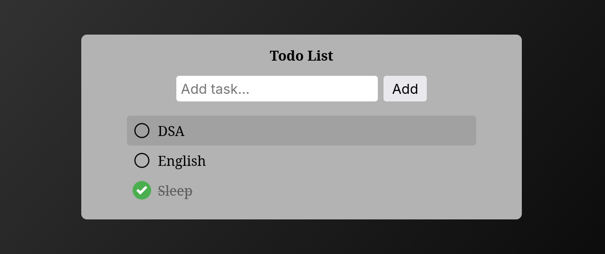

# To-Do App 

 A simple and clean To-Do List Application built using HTML, CSS, and TypeScript.

 This project helps users manage daily tasks by adding, completing, and removing tasks easily.

---

## Tech Stack

- 
- 
- 

## App Preview

  

